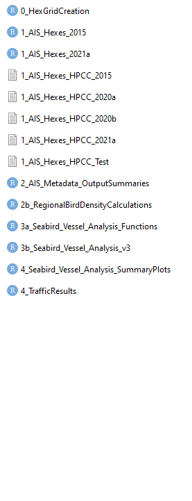
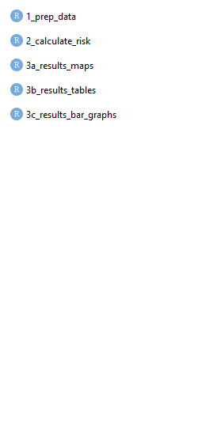

<!-- To render the lecture in Rmarkdown, enter the command below in the R console -->
<!-- rmarkdown::render("lecture20.Rmd") -->

## A caveat

<center>
This is relatively new to me - I've only been working with pipeline tools for a few months. If you notice something incorrect or have another idea, please let me know so I can fix it!
</center>

## What are data pipeline tools? {.build}

- Also known as a workflow management software 

- Software that helps to automate a series of tasks. 

- Automatically update outputs based on changes you make to your workflows (without re-running unnecessary steps!).

- Examples include: 
  + [GNU Make](https://www.gnu.org/software/make/): Original software, can be implemented in any coding language
  + [Targets](https://github.com/ropensci/targets): For use with R
  + [Snakemake](https://github.com/snakemake/snakemake): For use with Python


## Why should you use data pipelines in your analysis? {.build}

- Speed up your analyses 

- Improved readability and re-usability

- Organize complex workflows (E.g., multiple study areas, lots of variables, many steps)

- Compatible with parallel computing (I haven't actually testing this yet)

## 

```{r, echo=FALSE, warning=FALSE}
# 
# 

library(cowplot)
library(ggplot2)

p1 <- ggdraw() + draw_image("./figures/before_targets.png", scale = 1)
p2 <- ggdraw() + draw_image("./figures/right_arrow.png", scale = 0.2)
p3 <- ggdraw() + draw_image("./figures/after_targets.png", scale = 1)

plot_grid(p1, p2, p3, nrow=1, ncol=3)

``` 

## When would data pipelines not be a good idea? {.build}

- Simple, straightforward analyses 

- Exploratory analyses

- Short time frames


## The Targets Package for R {.build}

- Workflows organized as a series of "targets"

- Targets are given an input function and a name for the outputs 

- Code organized into functions 

- Specific folder structure 

## Folder structure for the Targets Package
```{}
├── _targets.R
├── data.csv
├── R/
│   ├── functions.R
```

## Targets Tutorial


